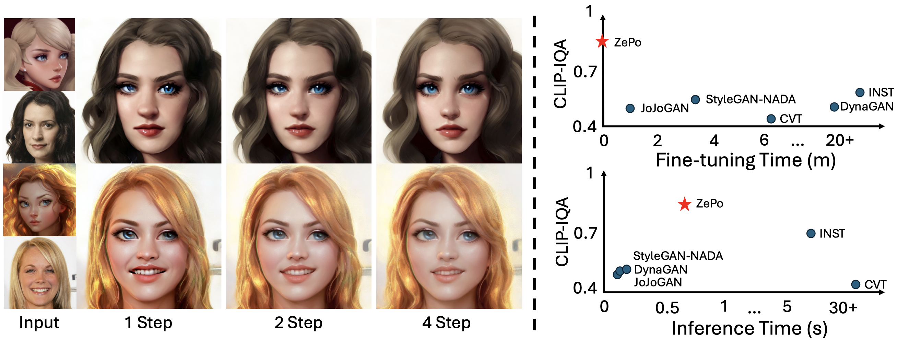

## ZePo: Zero-Shot Portrait Stylization with Faster Sampling

[Jin Liu](https://github.com/liujin112), [Huaibo Huang](https://scholar.google.com/citations?user=XMvLciUAAAAJ&hl=en&oi=sra), [Jie Cao](https://scholar.google.com/citations?user=lPLM5oMAAAAJ&hl=en), [Ran He](https://scholar.google.com/citations?user=ayrg9AUAAAAJ&hl=en&oi=sra).

Pytorch implementation of [ZePo: Zero-Shot Portrait Stylization with Faster Sampling](https://arxiv.org/abs/2408.05492)

[](https://arxiv.org/abs/2408.05492)
[](https://huggingface.co/spaces/Jinl/zepo)
---

## Introduction

Diffusion-based text-to-image generation models have significantly advanced the field of art content synthesis. However, current portrait stylization methods generally require either model fine-tuning based on examples or the employment of DDIM Inversion to revert images to noise space, both of which substantially decelerate the image generation process. To overcome these limitations, this paper presents an inversion-free portrait stylization framework based on diffusion models that accomplishes content and style feature fusion in merely four sampling steps. We observed that Latent Consistency Models employing consistency distillation can effectively extract representative Consistency Features from noisy images. To blend the Consistency Features extracted from both content and style images, we introduce a Style Enhancement Attention Control technique that meticulously merges content and style features within the attention space of the target image. Moreover, we propose a feature merging strategy to amalgamate redundant features in Consistency Features, thereby reducing the computational load of attention control. Extensive experiments have validated the effectiveness of our proposed framework in enhancing stylization efficiency and fidelity.



## To-do

- [X] Release the code.
- [X] Online Demo

## Usage

### Requirements

We implement our method with [diffusers](https://github.com/huggingface/diffusers) and the code runs on Python 3.9 with Pytorch 2.0.1. You can install the environment by following commands.

```base
conda create -n zepo python=3.9
conda activate zepo
conda install pytorch==2.0.1 torchvision==0.15.2 torchaudio==2.0.2 pytorch-cuda=11.8 -c pytorch -c nvidia
pip install diffusers transformers gradio accelerate PEFT xformers==0.0.20
```

### Checkpoints

**Latent Consistency Model:**
Our method mainly based on Latent Consistency Model, [diffusers](https://github.com/huggingface/diffusers) automatically downloads the required model weights. If necessary, you can also manually download them from [this link](https://huggingface.co/SimianLuo/LCM_Dreamshaper_v7).

### Inference with example data:

```bash
bash run.sh
```

### Inference with your own data:

Please place the style and content images into separate folders, and then run the following command.

```bash
export CUDA_VISIBLE_DEVICES=0
python main.py --output 'PATH to Results' \
                    --content' PATH to Content' \
                    --style 'PATH to Style' \
                    --sty_guidance 1.2 \
                    --num_inference_steps 2 \
                    --tome
```

### Run the Local Gradio Demo:

```bash
python app.py
```

## Acknowledgements

Our code follows several excellent repositories. We appreciate them for making their codes available to the public.

- [Prompt-to-Prompt](https://github.com/google/prompt-to-prompt)
- [Masactrl](https://github.com/TencentARC/MasaCtrl)
- [latent-consistency-model](https://github.com/luosiallen/latent-consistency-model)

## Citation

```bibtex

@inproceedings{liu2024zepo,
      title={ZePo: Zero-Shot Portrait Stylization with Faster Sampling}, 
      author={Jin Liu and Huaibo Huang and Jie Cao and Ran He},
      booktitle={Proceedings of the 32st ACM International Conference on Multimedia (ACM MM)},
      year={2024},
}
```

## Contact

If you have any comments or questions, please [open a new issue](https://github.com/liujin112/ZePo/issues/new/choose) or feel free to contact the authors.
